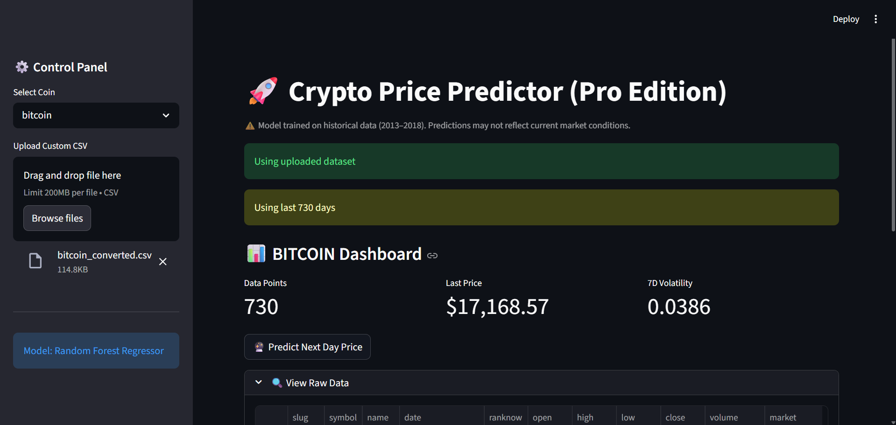
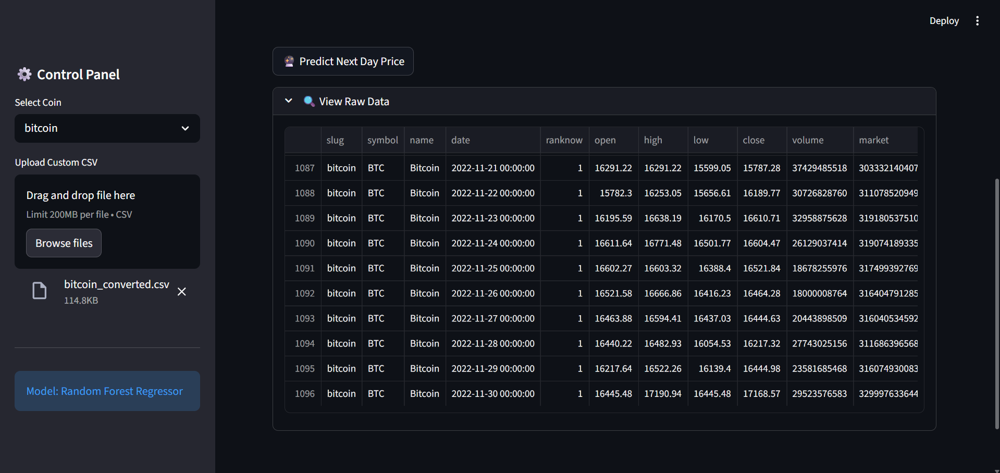
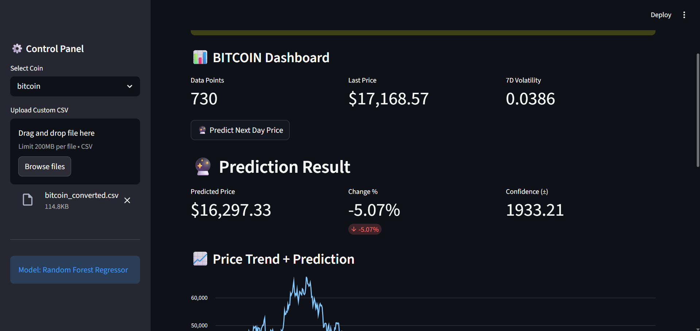
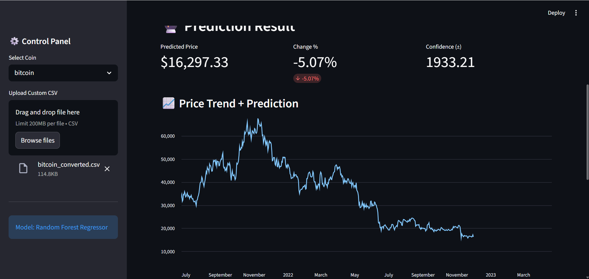

# 🚀 Crypto ML Predictor

## 📌 Project Overview
This project predicts cryptocurrency prices using machine learning models including **Random Forest Regressor** and **Support Vector Machine (SVM)**.  
It covers the workflow from **data exploration**, **model training and evaluation**, to a **Streamlit-based interactive app** for testing predictions.  

The main goal is to provide a **user-friendly interface** for predicting cryptocurrency values based on historical data.

---

## 🧠 Key Features
- Historical crypto data analysis and visualization  
- Training and evaluation of ML models  
- Interactive Streamlit app for price prediction  
- Visualization of model performance and predictions  

---

## 🖼️ App Screenshots

**1. Home / Dashboard Screen**  

**2. Data Upload & Selection Screen**  

**3. Model Prediction Screen**  

**4. Evaluation & Metrics Screen**  

## 🚀 Future Improvements
- Enable uploading of custom datasets in the app  
- Real-time cryptocurrency data integration  
- Automated retraining pipeline for ML models  
- Deployment of the app for public access
